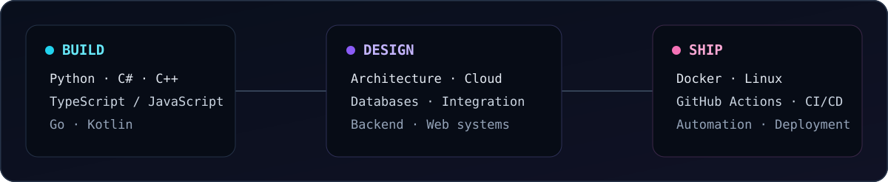
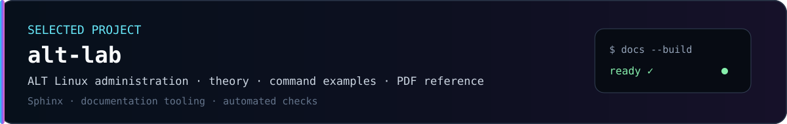

  

## About

I'm **akayahiko**, a **Dev & DevOps Engineer** focused on building and operating software systems.

My work sits across **architecture, cloud, databases, backend development and automation**. I enjoy projects where development and infrastructure meet: designing the system, implementing it, setting up delivery and getting the whole thing running reliably.

  

## Languages

- **Python** — primary language, Middle level
- **C# / C++** — Junior level
- **TypeScript / JavaScript** — Junior level
- **Go / Kotlin** — project experience

## Frameworks & tools

## Mentoring & expertise

- **Expert Mentor** at regional championships in the competency  
  **«Корпоративная защита от внутренних угроз информационной безопасности»**.
- **Expert Mentor for student projects** at **South Ural State University (SUSU / ЮУрГУ)**.

## Selected work

  

  
  

---

  architecture · code · infrastructure · delivery

